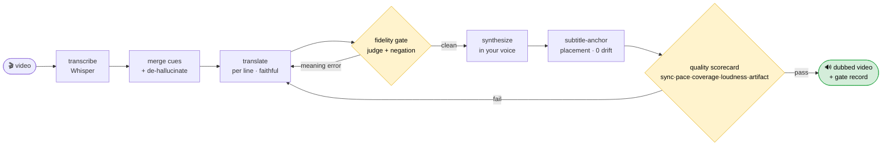
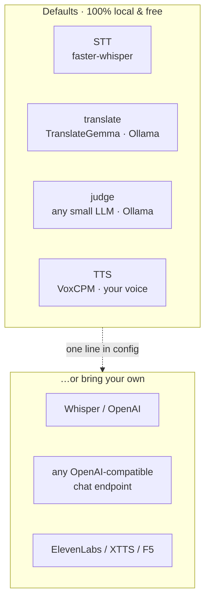

# VoiceCloneDub

[](https://github.com/dalsoop/voiceclonedub/actions/workflows/ci.yml)
[](https://www.python.org/downloads/)
[](https://github.com/astral-sh/ruff)
[](https://mypy-lang.org/)
[](LICENSE)

**Dub any video into another language — in your own voice. Fully local. Free.**

VoiceCloneDub takes a talking-head video, transcribes it, translates it faithfully, and
re-voices it **in your own voice** — placed at the exact moments you originally spoke,
like subtitles you can *hear*. No cloud, no per-minute billing: it runs on local models
you already have (or can pull in two commands).

> Give it a 6-minute Korean lecture and a 10-second clip of your voice → get back the
> same lecture in English, in your voice, lip-time-aligned to the original.

<!-- Demo: drop a before/after clip or GIF here once you have one -->
<!--  -->

## See it in action

One Korean lecture, re-voiced into three languages — **same voice, same timing**. Here's
the very same moment in each (full text, nothing dropped):

| Lang | Line |
|------|------|
| 🇰🇷 **KO** *(source)* | 우리 AI한테 그냥 맡기지 맙시다, 키워드를 드릴게요. |
| 🇺🇸 **EN** | Let's **not** just leave it to our AI; I'll give you the keywords. |
| 🇯🇵 **JA** | AIに**すべてを任せず**、キーワードをお渡しします。 |
| 🇨🇳 **ZH** | 我们**不要**直接交给人工智能，我来提供关键词。 |

> The negation (*"let's **not** …"*) survives in **all three** languages — general chat LLMs
> routinely drop it. That's the fidelity gate doing its job.

Another line, end to end:

| Lang | Line |
|------|------|
| 🇰🇷 **KO** | 아주 큰 문제죠. 우리 Git을 왜 쓰는지는 아시는 거 같아요. |
| 🇺🇸 **EN** | It's a very big problem. I think you know why we use Git. |
| 🇯🇵 **JA** | とても大きな問題ですね。私たちがGitをなぜ使うのか、ご存知だと思います。 |
| 🇨🇳 **ZH** | 这是一个非常大的问题。我觉得你们应该知道我们为什么使用 Git。 |

Every render also drops a JSON record next to the video with its gate results, e.g.:

```json
{ "tgt": "en", "ok": true, "segs": 9,
  "gates": { "coverage": 1.0, "drift_max": 0.0, "overlap": [], "too_fast": [],
             "fidelity_errors": [], "word_trimmed": [],
             "loudness": { "dub_peak_db": -2.8, "target_peak_db": -1.5, "orig_lufs": -21.5, "ok": true },
             "artifact": { "out_exists": true, "has_video": true, "has_audio": true, "ok": true } } }
```

---

## Why VoiceCloneDub is different

Most "AI dubbing" tools either sound nothing like you, drift out of sync as the video
goes on, or quietly drop half of what you said to make the timing fit. VoiceCloneDub is built
around three hard rules, each enforced by a deterministic gate — not vibes:

- **Your voice, not a stranger's.** Zero-shot voice cloning from a short reference clip.
- **Subtitle-accurate timing (no drift).** Every line is *anchored* to the moment you
  actually said it in the source. The dub never runs ahead of the video — drift is
  measured and gated at `0`. (See [How it works](#how-it-works).)
- **Faithful translation (nothing dropped, nothing flipped).** A translation-specialist
  model does the translating, and an independent judge + a deterministic negation
  checker catch the classic failure modes (dropped "not", wrong numbers, missing clauses)
  before anything gets synthesized.

It's the difference between a dub that's *technically in another language* and one you'd
actually publish.

## Features

- 🎙️ **Your own voice** via zero-shot TTS (a few seconds of reference audio).
- ⏱️ **Isochrony / subtitle-anchor sync** — speech lands where you spoke it; **0 drift** by construction.
- 🌍 **Faithful, length-aware translation** with a fidelity gate (negation/number/entity/omission checks).
- 🧱 **Deterministic quality scorecard** — sync (drift, overlap), pace (too-fast, word-trimming), content (fidelity, coverage, negation), **loudness** (transparent peak-normalization, gated against clipping/near-silence), and **artifact integrity** (the versioned output really exists, with video+audio) — a run either passes or tells you exactly which metric failed.
- ♻️ **Incremental + cached** — re-runs only re-translate/re-synthesize what changed.
- 🗂️ **Versioned output + per-run records** — every render is timestamped and logged with its gate results; nothing is overwritten.
- 🏠 **100% local & free** by default (Ollama + faster-whisper + VoxCPM). Bring-your-own OpenAI-compatible endpoints if you prefer.

## Quickstart

```bash
# 1. system deps
brew install ffmpeg          # or: apt-get install ffmpeg
# install Ollama from https://ollama.com, then:
ollama pull translategemma:12b      # faithful translation
ollama pull qwen3:8b                # fidelity judge (any small instruct model works)

# 2. install VoiceCloneDub
pip install voiceclonedub          # (or: pip install -e . from a clone)

# 3. dub a video into your voice
dub myvideo.mp4 --from ko --to en --voice my_voice.wav
```

Output lands in `out/<video>/en-<timestamp>.mp4` with a JSON record of every gate result
next to it.

> **Voice reference (`--voice`)**: 5–15 seconds of clean speech of the target speaker
> (you). The cleaner the sample, the closer the dub.

## Use as a Claude Code plugin

Prefer to drive it from [Claude Code](https://claude.com/claude-code)? VoiceCloneDub also ships as
a plugin. Installing it adds a self-correcting **dub** skill and a **doctor** skill — no `pip`
needed (the engine is standard-library Python; only local Whisper STT needs an extra install).

```text
/plugin marketplace add dalsoop/voiceclonedub
/plugin install voiceclonedub@voiceclonedub
```

Then just ask:

> dub this lecture into English and Japanese, in my voice — here's a reference clip.

The **dub** skill runs the engine, reads the per-render quality scorecard, fixes only the segments
that failed (re-translate / re-tighten / re-synthesize), and loops until every gate passes — then
reports exactly what it produced. Run `/voiceclonedub:doctor` first to check ffmpeg and your
backends.

> The plugin makes the commands instant; the backends (ffmpeg, an Ollama model or two, a VoxCPM
> TTS endpoint) still need to be running — `doctor` tells you precisely what's missing.

## Usage

```
dub INPUT.mp4 --to en [--from ko] [--voice ref.wav] [options]

  --from LANG        source language (default: auto-detect)
  --to LANG          target language(s), comma-separated (e.g. en,ja)
  --voice PATH       reference audio for voice cloning
  --rounds N         max refit rounds (default: 3)
  --config PATH      config file (default: ./voiceclonedub.toml then ~/.config/voiceclonedub.toml)
  --out DIR          output directory (default: ./out)
```

Examples:

```bash
dub talk.mp4 --to en,ja --voice me.wav           # English + Japanese
dub lecture.mov --from ko --to en --rounds 4     # more refit passes
```

## How it works



Every box is a **pluggable backend** — keep the local defaults, or point any stage at your
own OpenAI-compatible endpoint with one line of config:



The interesting parts, and *why* they exist:

1. **Clean the transcript before anything else reads it.** The audio is first extracted to
   16 kHz mono — Whisper's native format — so STT starts from the input it was trained on.
   Raw STT still emits sub-second cues and sometimes *repeats a line* (a classic Whisper
   hallucination); VoiceCloneDub merges cues into sentence-level segments and drops adjacent
   near-duplicates **deterministically**, so you never hear the same phrase twice or get two
   voices overlapping. The translator only ever sees clean sentences — it is never asked to
   *clean up garbage and translate in the same breath*.

2. **Faithful translation, not summarization.** Translation is done one line at a time by
   a translation-specialist model (TranslateGemma by default). General chat LLMs quietly
   drop Korean negation like *“…하지 맙시다”* (“let's **not** …”) — VoiceCloneDub uses a model
   that doesn't, and then **double-checks**: an independent LLM judge plus a deterministic
   negation detector flag dropped negations / wrong numbers / missing clauses, and only
   those lines get re-translated.

3. **Subtitle-anchor placement (the sync trick).** Each translated line is placed at the
   *original* start time — like a subtitle. English is usually shorter than the source, so
   instead of stretching audio (sounds sluggish) or letting it slide forward (drifts out
   of sync), VoiceCloneDub just leaves the natural gap. Result: **drift is exactly 0** and the
   words land where your mouth moves. Lines that run long are gently compressed; the rest
   is left alone.

4. **Deterministic gates.** A render reports `ok: true` only if it passes every hard gate
   (no empty/dropped lines, no overlap, nothing too-fast or word-trimmed, STT coverage ≥
   0.85, drift ≤ 0.5s). Otherwise it tells you exactly which segments failed, so the loop
   (or you) can fix just those.

## Getting good results

Quality is mostly decided *before* translation even starts — by the input and a couple of flags:

- **Input audio is the biggest lever.** Clean, single-speaker speech (a lecture, a talking-head
  video, a one-host podcast) transcribes far better than music, crowd noise, or overlapping
  speakers. If the source is noisy, expect more lines to get flagged.
- **Tell it the source language.** Pass `--from ko` (or whatever it is) instead of relying on
  auto-detection — it removes a whole class of mis-detection and mid-clip language-switch
  errors, especially for non-English audio.
- **Let it do the boring-but-critical prep.** No need to pre-process anything: it extracts
  16 kHz mono audio (Whisper's native format), de-hallucinates repeated/fragmented cues, and
  merges them into sentence-level segments before the translator sees a thing.
- **It surfaces mistakes instead of hiding them.** A misheard word can't be magicked back, but
  it won't be shipped silently either: the coverage gate re-transcribes the output and
  fuzzy-matches each line, the negation checker and fidelity judge catch dropped meaning, and
  the run record names the exact segments that need a human look.
- **Accuracy vs. speed.** The default Whisper `large-v3` is the most accurate; smaller models
  (`medium`, `small`) are faster but transcribe worse — fine for quick drafts, not final cuts.

> The throughline: each stage does **one** job, structural noise is removed deterministically
> before any model reads it, and a model's output is *verified* rather than trusted — which is
> why results hold up instead of degrading line after line.

## Configuration

Everything is configurable; the defaults target a local Ollama + faster-whisper + VoxCPM
stack. Copy `voiceclonedub.example.toml` to `voiceclonedub.toml` and edit:

```toml
[translate]                       # faithful KO→EN translation
backend = "ollama"
model   = "translategemma:12b"
# endpoint = "http://localhost:11434/v1"   # or any OpenAI-compatible URL

[judge]                           # fidelity check (any small instruct LLM)
backend = "ollama"
model   = "qwen3:8b"

[stt]                             # transcription
backend = "faster-whisper"        # or an OpenAI-compatible /audio/transcriptions URL
model   = "large-v3"

[tts]                             # your-voice synthesis
backend = "voxcpm"
# endpoint = "..."                # or a self-hosted OpenAI-compatible TTS
```

Already running your own model servers? Point each backend at its OpenAI-compatible
endpoint and VoiceCloneDub will use them as-is.

## Requirements

- Python 3.10+
- `ffmpeg` on PATH
- A backend for each stage (defaults: [Ollama](https://ollama.com),
  [faster-whisper](https://github.com/SYSTRAN/faster-whisper),
  [VoxCPM](https://github.com/OpenBMB/VoxCPM)) — or your own OpenAI-compatible endpoints.

## Roadmap

- [ ] One-command setup script that pulls all default models
- [ ] Before/after demo assets
- [ ] Web UI
- [ ] More TTS backends (XTTS, F5-TTS) behind the same interface
- [ ] Lip-sync (mouth) alignment pass

## Development

```bash
git clone https://github.com/dalsoop/voiceclonedub
cd voiceclonedub
pip install -e ".[dev]"                  # ruff + mypy + pytest

ruff check . && ruff format --check .     # lint + format
mypy src                                  # type-check
pytest                                    # unit tests

pre-commit install                        # optional: run ruff on every commit
```

The project uses a `src/` layout, is fully type-hinted (PEP 561 `py.typed`), and ships a
GitHub Actions workflow that runs ruff, mypy, and pytest on Python 3.10–3.13 for every push
and pull request.

## License

MIT — see [LICENSE](LICENSE).

---

<sub>VoiceCloneDub keeps your timing, your meaning, and your voice. If it helps, a ⭐ goes a long way.</sub>
